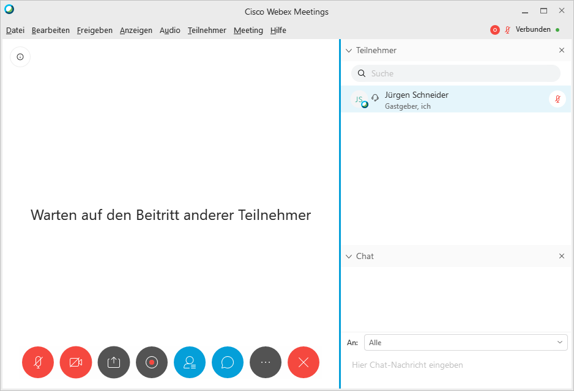
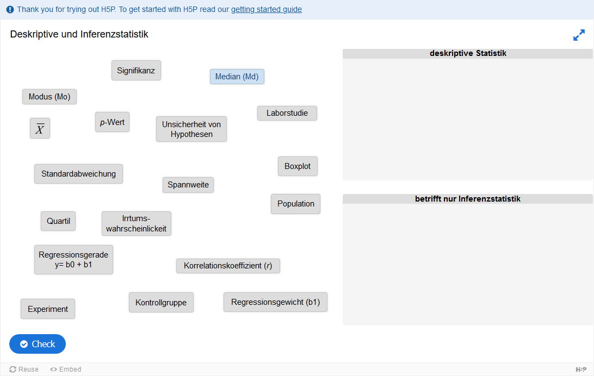
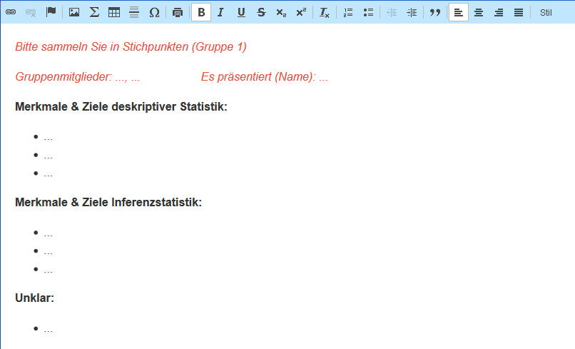

```{r setup, include=FALSE}
knitr::opts_chunk$set(echo = FALSE, warning = F, message = F)
# download.file("https://drive.google.com/uc?export=download&id=1wuMqL_Z8T9rxuGvn0VP6siag90kHDm2O", 
#               "../www/references.bib", overwrite = T)

library(shiny)

```

## webex



<div style="position:absolute; top:17%; left:62%;" >

* Mikrofon/ Video an/aus<br />(alle Zuhörenden bitte Mikrofon aus)

\

* Bildschirm/ Inhalte teilen

\

* Chat

\

* Sitzungsaufzeichnung

</div>

## Kommunikation

* Video
  * wir probieren es mit Video
  * bei Störungen: alle ausschalten (außer mir)

\

* "sich melden"
  * mit Video: Hand hoch/ in die Kamera (gern auch sprachlich)
  * ohne Video: Video anschalten

\

* "ja" / "nein"
  * in Chat
  * ggf. Video anschalten

## Ablauf der Sitzung

1. Seminarüberblick
2. Deskription vs. Inferenz
3. Übung mit Artikel

# Seminardetails

## Seminarüberblick | Formales


* Überblicksveranstaltung: 2 CP für
  * Vor- und Nachbereitung (Texte, Videos, Aufgaben)
  * 50% der Aufgabenpunkte

\

* Vertiefungsveranstaltung: 4 CP für
  * Vor- und Nachbereitung (Texte)
  * "Assignments" mit `r icon("r-project")`
  * Hausarbeit (bald unter "Hausarbeiten: Aufgaben und Instruktion" auf Moodle > Allgemeines)
  * keinerlei Anwesenheitspflicht - aber bitte Versäumtes eigenständig “nacharbeiten”
  
  
## Seminarüberblick | Inhaltlich

* dekriptive Statistik & Inferenzstatistik
* Wahrscheinlichkeitstheorie
* frequentistisches Nullhypothesentesten
* Hypothesentesten mit BAyes Faktoren
* Inferenzstatistiken zu Cohen's d, Pearson's r, Kendall's $\tau$
* Regression
* Data Wrangling
* Dummy Codierungen
* Voraussetzungen

## Seminarüberblick | Didaktisches

* Semester
  * Erste Hälfte: Jürgen Schneider
  * Zweite Hälfte: Samuel Merk

\

* 14-16 Uhr asynchron; 16-18 Uhr synchron
  * flipped classroom
  * selbst erkundend
  * Werkstattcharakter
  
## Seminarüberblick | Seminarphilosophie

* aktive Teilnahme macht das Seminar spannend

\

* alle Fragen & Diskussionsbeiträge sind erwünscht!

\

* wertschätzender Umgang 


# deskriptive und Inferenzstatistik

## Deskription vs. Inferenz
Aus WiSe  
_"Einführung in die Methoden empirischer Forschung in der Schulforschung/Schulentwicklung"_  
kennen Sie:

* empirische Variablen (Skalenniveaus, UV/ AV)
* zentrale Tendenzen & Streuungsmaße
* Häufigkeitsverteilungen
* Transformationen
* Unterschiede in der zentralen Tendenz zweier
  * ordinaler Variablen
  * metrischer Variablen
* Zusammenhang zweier metrischer Variablen
  * Korrelation
  * Regression


## Deskription vs. Inferenz
 __Was sind Merkmale und Ziele deskriptiver Statistik und Inferenzstatistik?__  
 \
 
 <div style="position: absolute; top: 30%; left: 5%; width: 35%">
 Ordnen Sie die Begriffe jeweils zu.  
 Einzelarbeit, 3min.  
 [Link zu H5P](https://h5p.org/node/805518)  
 \
 
 
</div>

<div  style="position: absolute; top: 30%; left: 44%; width: 50%">
 
 1. Sammeln Sie Merkmale und Ziele deskriptiver und Inferenzstatistik  
 2. Welche Begriffe waren Ihnen in der Zuordnungsaufgabe unklar?
 
 Schreibdiskussion, ~4er Gruppen, 10-15min  
 Links zur Pads: [Gruppe1](https://cryptpad.fr/pad/#/2/pad/edit/xD55qauJL16jtz0wcAD9jqt2/), [Gruppe 2](https://cryptpad.fr/pad/#/2/pad/edit/iN8onrJZZJ0MYnjsacMezyWg/), [Gruppe 3](https://cryptpad.fr/pad/#/2/pad/edit/8FEVjijEFYn6qdxcqsgxIQY5/)  
   
 
</div>

## Deskription vs. Inferenz
<iframe src="https://h5p.org/h5p/embed/805518" width="1090" height="450" frameborder="0" allowfullscreen="allowfullscreen"></iframe>

## Deskription vs. Inferenz
<iframe src="https://cryptpad.fr/pad/#/2/pad/edit/xD55qauJL16jtz0wcAD9jqt2/embed/"></iframe>

## Deskription vs. Inferenz
<iframe src="https://cryptpad.fr/pad/#/2/pad/edit/iN8onrJZZJ0MYnjsacMezyWg/embed/"></iframe>

## Deskription vs. Inferenz
<iframe src="https://cryptpad.fr/pad/#/2/pad/edit/8FEVjijEFYn6qdxcqsgxIQY5/embed/"></iframe>

## deskriptive Statistik

__Beispiel Vorwissen erheben__  

vor diesem Kurs mache ich einen _Test_, um nachzuvollziehen...

* welche Lehrinhalte bereits bekannt sind und welche weniger
* wie unterschiedlich die Kenntnisstände sind
* wie sich einzelne Personen entwickeln (benötigt Nachtest)

## deskriptive Statistik | Datenmatrix

Erhobene Daten in einer Datenmatrix verzeichnet  
```{r}
library(pander)
datmat <- data.frame(Name = c("Fischer", "Zipfer", "Moretti", "Leffe", "..."),
                     Aufgabe1 = sample(1:3, 5, replace = T),
                     Aufgabe2 = sample(1:3, 5, replace = T),
                     Aufgabe3 = sample(1:3, 5, replace = T),
                     Aufgabe4 = sample(1:3, 5, replace = T),
                     Aufgabe5 = sample(1:3, 5, replace = T),
                     Aufgabe6 = sample(1:3, 5, replace = T),
                     '...' = rep("...", 5))
pander(datmat)
```

[@eidetal.2015, Kap. 6]

## deskriptive Statistik
```{r}
pander(datmat)
```
\

Beschreibung der Daten anhand

* Zusammenfassung
* der Daten aus der Datenmatrix = Stichprobe
* d.h. Beschreibung der Merkmalsausprägungen von Objekten
* univariat & multivariat

[@eidetal.2015, Kap. 6; @doringetal.2016, Kap. 12.2]

## Inferenzstatistik | Warum überhaupt?

<p style="background-color:#dbe9f4; padding: 7px">
__Beispiel__  
Ich habe einen Onlinekurs erstellt, mit dem Computational Thinking von SuS trainiert wird. Ich behaupte damit können alle deutschsprachigen SuS der Klasse 8 und 9 ihr Computational Thinking fördern! Gerade haben 25 SuS den Kurs durchlaufen, diese Gruppe hat im Kompetenztest zu Computational Thinking $\bar{x}= 515$ erzielt. Der Kompetenztest ist für SuS der 8. und 9. Klasse auf den Populationsmittelwert 500 normiert.
</p>

Ich meine: Mein Onlinekurs ist wirksam!  
Sie meinen: Meh...

## Inferenzstatistik | Warum überhaupt?

<p style="background-color:#dbe9f4; padding: 7px">
__Beispiel__  
Ich habe einen Onlinekurs erstellt, mit dem Computational Thinking von SuS trainiert wird. Ich behaupte damit können alle deutschsprachigen SuS der Klasse 8 und 9 ihr Computational Thinking fördern! Gerade haben 25 SuS den Kurs durchlaufen, diese Gruppe hat im Kompetenztest zu Computational Thinking $\bar{x}= 515$ erzielt. Der Kompetenztest ist für SuS der 8. und 9. Klasse auf den Populationsmittelwert 500 normiert.
</p>

Vorab: Was ist...

* Treatment/ unabhängige Variable
* abhängige Variable
* Population
* Populationsmittelwert
* Stichprobenmittelwert

## Inferenzstatistik | Warum überhaupt?

Machen Sie auch eine/ mehrere Studie/n!  
Jetzt ganz einfach mit der [App](https://shiny.jschn.org/qda-ss2020/1_Sitzung/studygen.Rmd).
\

__Auftrag:__  

* Sie möchten eine Studie durchführen, um herauszubekommen, ob mein Onlinekurs wirkt. Die SuS der Studie nehmen am Onlinekurs teil und machen den Kompetenztest. In der App sehen Sie deren Ergebnisse.
* Spielen Sie ein wenig an den Einstellungen herum: Was können Sie beobachten?
* Welche Erkenntnis können Sie in Bezug auf meine Aussage generieren? 

Ca. 7min


## Inferenzstatistik

* Empirische Forschung: Stichprobenansatz nötig
* zufällige Auswahl bestimmter Ereignisse (mit besonderen Merkmalen)?
* Aufgabe Inferenzstatistik: Mit welcher Sicherheit können wir von __beobachteten__ Ereignissen auf __allgemeine Gesetzmäßigkeiten__ schließen?
* falsche Entscheidungen nie ausgeschlossen (z.B. _p-Wert_ $\approx P(Daten | \mu_{EG} = \mu_{KG})$)

[@eidetal.2015, Kap. 8]

# Übung

## Skimming eines Forschungsberichts

* Studie zu "Stereotypenbedrohung als Ursache für geringeren Wortschatzzuwachs"
* Frage: Geringerer Lernzuwachs von Kindern mit nicht deutscher Familiensprache, denen in einer Lernsituation __explizit/ implizit__ ein negatives Stereotyp über ihre Gruppe induziert wird
* Wortschatztest (Pretest) - Treatment + Lernphase - Wortschatztest (Posttest)

__Übung:__  

* Überfliegen Sie bitte den Artikel von Sander et al., 2018
  * Besonders Abstract, 3.1 Stichprobe, Ergebnisse (4.1, 4.2)
* Posten & voten:
  * Welche Punkte finden Sie hier potentiell diskussionswürdig?
  * Was haben Sie nicht verstanden?

Hier posten: [pollev.com/js123](https://pollev.com/js123)

(Sander, Ohle, McElvany, Zander, & Hannover, 2018)

## Skimming eines Forschungsberichts

<iframe src="https://embed.polleverywhere.com/discourses/JiHGduN84emGvfbsG1Jfx?controls=all&short_poll=true" width="800" height="600" frameBorder="0"></iframe>

# Vielen Dank | Für die Aufmerksamkeit

# Literatur