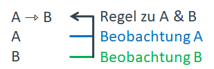
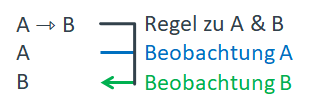
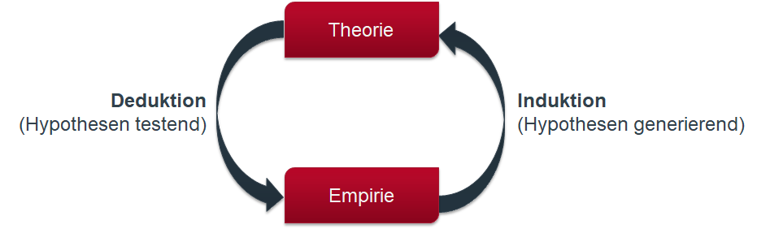

```{r setup, include=FALSE}
knitr::opts_chunk$set(echo = FALSE, warning = F, message = F)
# download.file("https://drive.google.com/uc?export=download&id=1wuMqL_Z8T9rxuGvn0VP6siag90kHDm2O", 
#               "../www/references.bib", overwrite = T)

library(shiny)

```

## zoom | bei Problemen


* ihr Video ausschalten

\

* aus- & wieder einloggen

\

* melden (Chat oder sprachlich) <br />(alle schalten Video aus)

\

* nachträglich Video anschauen

## Lernziele

* Zusamenhänge zwischen $\alpha$, $\beta$, $N$, Effekstärke kennen und verstehen
* Zusammenhäng zwischen Erkenntnislogiken und kritischem Rationalismus kennen und verstehen
* theoretische Aussagen nach ihrem Informationsgehalt beurteilen können

## Ablauf der Sitzung

1. Visualisierung zu $\alpha$, $\beta$, $N$, Effekstärke
   - Fragen zum Erklärvideo/ Aufgaben
2. Erkenntnislogiken
3. Informationsgehalt & Falsifizierbarkeit theoretischer Aussagen


## Rückblick | Erklärvideo

* Nullhypothesen-Signifikanztest (NHST) nach Fischer

\

* Binäres Entscheidungskonzept ($H_0, H_A$) nach Neyman & Pearson

\

* $\alpha$-Fehler (Fehler 1. Art/ type I error) & $\beta$-Fehler (Fehler 2. Art/ type II error) 

## Einstieg | Zusamenhänge & Fragen

__Wie hängen...__

* $\alpha$, 
* $\beta$, 
* die Effektstärke und 
* die Stichprobengröße

zusammen?

\

Zusammenhänge ergründen: [NHST-App](https://rpsychologist.com/d3/nhst/)

## Einstieg | Zusammenhänge ergründen: [NHST-App](https://rpsychologist.com/d3/nhst/)

`r icon("hand-point-right")` "Solve for: Power" & "One-Tailed"
\
\

Elaborieren Sie anhand der Grafik und unseren bisherigen Inhalten zur WK-Theorie:  
`r icon("question-circle")` __Was bedeuten__: die beiden Kurven, $\alpha$, $\beta$, $1-\beta$ (Power), $Z_{crit}$  
`r icon("question-circle")` __Was verändert sich__, was nicht? Und was bedeutet das? Wenn Sie...  
&nbsp;&nbsp;&nbsp;&nbsp;&nbsp;- das $\alpha$-Niveau ändern  
&nbsp;&nbsp;&nbsp;&nbsp;&nbsp;- die Effektgröße verändern

`r icon("question-circle")` __Ihr Projektbudget...__  
reicht für 200 Versuchsteilnehmende. Sie möchten herausfinden, ob bestimmte Gruppen eine höhere Lesekompetenz aufweisen als der Durchschnitt (Lesekompetenztest für 15-jährige SuS normiert). Sie legen das Signifikanzlevel bei $\alpha = .05$ fest. Was würden Sie tun: Testen Sie lieber mehrere Gruppen mit kleinen Stichproben (z.B. $n=50$) oder eine große Stichprobe?

__Fragen__ für Plenum: [pollev.com/js123](https://pollev.com/js123)

## Einstieg | Alphafehler-Kumulierung

Family-wise error rate: $\bar{\alpha} = 1- (1-\alpha)^m$  
_wobei $m$: Anzahl der Tests_

\

`r icon("hand-point-right")` WK einen oder mehrere $\alpha$-Fehler zu begehen.

\
__Lösung:__  
z.B. Anpassung $\alpha$-Niveau durch Bonferroni-Korrektur: $\alpha'=\frac{\alpha}{m}$


## Einstieg

<iframe src="https://embed.polleverywhere.com/discourses/JiHGduN84emGvfbsG1Jfx?controls=none&short_poll=true" width="800" height="600" frameBorder="0"></iframe>


## Einstieg


# Erkenntnislogiken | Induktion & Deduktion


## Erkenntnislogiken | Induktion & Deduktion

__Induktion:__ Vom Speziellen auf das Allgemeine
\

<div class="box45l" style="margin-top: 5%">
<span style="color:blue">Beobachtung A</span>  
wertschätzender Umgang in der Klasse
\
\


</div>

<div class="box45r" style="margin-top: 5%">
<span style="color:green">Beobachtung B</span>  
konzentriertes Arbeiten in der Klasse
\
\


</div>

## Erkenntnislogiken | Induktion & Deduktion

__Induktion:__ Vom Speziellen auf das Allgemeine
\

<div class="box45l" style="margin-top: 5%">
<span style="color:blue">Beobachtung A</span>  
wertschätzender Umgang in der Klasse
\
\

hohe Anzahl an Störchen
</div>

<div class="box45r" style="margin-top: 5%">
<span style="color:green">Beobachtung B</span>  
konzentriertes Arbeiten in der Klasse
\
\

hohe Geburtenrate
</div>




## Erkenntnislogiken | Induktion & Deduktion

__Deduktion:__ Vom Allgemeinen auf das Spezielle
\

Wenn <span style="color:blue;">in Klassen ein wertschätzender Umgang gepflegt</span> wird, dann <span style="color:green;">wird konzentriert gearbeitet</span>.

## Erkenntnislogiken | Induktion & Deduktion

__Deduktion:__ Vom Allgemeinen auf das Spezielle
\

Wenn <span style="color:blue;">in Klassen ein wertschätzender Umgang gepflegt</span> wird, dann <span style="color:green;">wird konzentriert gearbeitet</span>.
\
\

Wenn <span style="color:blue;">eine hohe Anzahl von Störchen in der Gegend zu sehen</span> sind, dann <span style="color:green;">führt es zu einer hohen Geburtenrate</span>.




## Erkenntnislogiken | Induktion & Deduktion




## Falsifizierbarkeit & Informationsgehalt | theoretischer Aussagen

"Wenn gewalthaltige digitale Spiele genutzt werden, dann zeigen sich verstärkt aggressive Gedanken."

"Wenn im Jugendalter sehr viele gewalthaltige digitale Spiele genutzt werden und eine Vernachlässigung durch die Eltern vorliegt und schlechte Bildungs- und Berufschancen bestehen und das Selbstwertgefühl gering ist, dann zeigen sich verstärkt aggressive Gedanken."

"Wenn gewalthaltige digitale Spiele oder gewalthaltige Fernsehprogramme genutzt werden, dann zeigen sich verstärkt aggressive Gedanken."

"Wenn gewalthaltige digitale Spiele genutzt werden, dann zeigen sich verstärkt aggressive Gedanken und aggressive Verhaltensweisen."

"Wenn gewalthaltige digitale Spiele genutzt werden, dann zeigen sich verstärkt aggressive Gedanken oder aggressive Verhaltensweisen."

# Vielen Dank | Für die Aufmerksamkeit

# Literatur