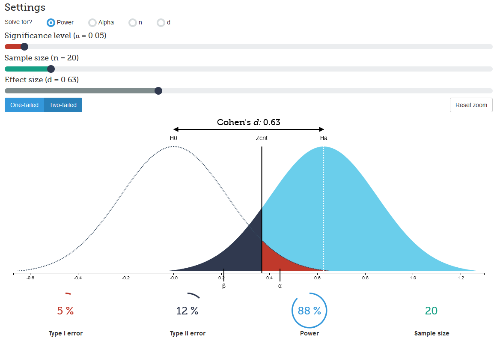

```{r setup, include=FALSE}
knitr::opts_chunk$set(echo = FALSE, warning = F, message = F)
# download.file("https://drive.google.com/uc?export=download&id=1wuMqL_Z8T9rxuGvn0VP6siag90kHDm2O", 
#               "../www/references.bib", overwrite = T)

library(shiny)
library(tidyverse)
library(BayesFactor)
```


## Lernziele

* #
\

* #
\

* #

## Ablauf | Diese Sitzung

* #

\

* #

\

* #

übertrag auf t-Verteilungen
  Daten generieren
  was ist auf x-Achse
  wie sind die Verteilungen der Hypothesen
Zusätzlich: Unsicherheit formulieren
t-Test
  Daten generieren
  t-Test machen
  t-Wert in grafik mit H0 visualisieren
t-Test BF
  priors 
  
  

## Letzte Sitzung

* Falsifizierbarkeit & Informationsgehalt theoretischer Aussagen

\

* Definition Bayes Factor, Punkt- & Verteilungshypothesen

\

* Übung zum Bayes Factor


## Falsifizierbarkeit & Informationsgehalt | theoretischer Aussagen

"Wenn gewalthaltige digitale Spiele genutzt werden, dann zeigen sich verstärkt aggressive Gedanken."

"Wenn gewalthaltige digitale Spiele genutzt werden, dann zeigen sich verstärkt aggressive Gedanken oder aggressive Verhaltensweisen."


## Falsifizierbarkeit & Informationsgehalt | theoretischer Aussagen

"Personen, die das Medikament LH einnehmen, haben eine __andere__ Schlafdauer als Personen, die das Medikament nicht einnehmen."

"Personen, die das Medikament LH einnehmen, haben eine __größere__ Schlafdauer als Personen, die das Medikament nicht einnehmen."

"Personen, die das Medikament LH einnehmen, schlafen durschnittlich __30 Minuten länger__ als Personen, die das Medikament nicht einnehmen."

"Personen, die das Medikament LH einnehmen, schlafen durschnittlich __ca. 30 Minuten länger__ als Personen, die das Medikament nicht einnehmen."

"Personen, die das Medikament LH einnehmen, schlafen durschnittlich __ca. 30-40 Minuten länger__ als Personen, die das Medikament nicht einnehmen."


## Beispiele

* 3-maliger Münzwurf: Wie oft kommt Kopf?
* Anteil der G9-Befürworter in der Population?

Siehe App:  
[https://shiny.jschn.org/qda-ss2020/4_Sitzung/bf.Rmd](https://shiny.jschn.org/qda-ss2020/4_Sitzung/bf.Rmd)


# R

## R | Code How-To Wiederholung

__Funktionen__
```{r , echo=T, eval=F}
### <b>
t.test()
### </b>
```
\

__Argumente__
```{r , echo=T, eval=F}
t.test(### <b>
formula = extra ~ group, 
       data = sleep
  ### </b>
       )
```

```{r , echo=T, eval=F}
t.test(formula = extra ~ group, 
       data = sleep,
### <b>
       alternative = "greater",
       var.equal = TRUE
### </b>
       )
```

## R | Code How-To Wiederholung

__Objekte__
```{r , echo=T, eval=T}
ein_Ergebnis <- 2 + 5
ein_Text <- "Das wird gespeichert"
ein_Datensatz <- data.frame(x = c(1,2,3,4,5),
                            y = c("A", "B", "C", "D", "E"))
ein_Datensatz
```

```{r , echo=T, eval=T}
Ergebnis_ttest <- t.test(formula = extra ~ group, 
                         data = sleep,
                         alternative = "greater",
                         var.equal = TRUE
                         )
```

## R | Code How-To Wiederholung

__Kommentare__
```{r , echo=T, eval=F}
# t-Test für unabhängige Stichproben
# Gruppe 1= KG, Gruppe 2= EG
# AV: Differenz der Schlafdauer
t.test(formula = extra ~ group, 
       data = sleep,                 # Student's sleep data (1908)
       # alternative = "greater",
       var.equal = TRUE
       )
```

# Punkt- & Verteilungshypothesen

## unsere Daten
```{r , echo=T, eval=T}
# Simulation von Daten
# mit Mittelwert 100, SD = 10
### <b>
mittel_diff <- 30    # Hier Ihren gewünschten Mittelwertsunterschied eingeben
### </b>

ttest_data <- data.frame(schlafdauer = c(rnorm(n = 10,
                                               mean = 480,
                                               sd = 30),
                                         rnorm(n = 10,
                                               mean = 480 + mittel_diff,
                                               sd = 30)),
                         gruppe = as.factor(c(rep("Kontrollgruppe", 10),
                                              rep("Experimentalgruppe", 10))))

ttest_data
```

## unsere Daten
```{r , echo=T, eval=T}
ggplot(ttest_data, aes(x=schlafdauer, group = gruppe, color = gruppe)) +
  geom_density()
```

## Punkthypothese $H_0$: t-Verteilung
__Dichtefunktion $H_0$__
```{r , echo=T, eval=T}
freiheitsgrade <- 58
t1_data <- data.frame(t = rt(n = 100000, 
                             df=freiheitsgrade
                             )
                      )
head(t1_data)
```

## Punkthypothese $H_0$: t-Verteilung

```{r , echo=T, eval=T, fig.height=3}
t_krit <- qt(0.95, 18)
t_krit
ggplot(t1_data, aes(x=t)) + 
  geom_density(color = "red") + 
  scale_x_continuous(limits = c(-7,7)) +
  geom_vline(xintercept = t_krit, color = "darkgrey")
```

## Punkthypothesen $H_0$ & $H_1$


## Verteilungshypothesen

```{r , echo=T, eval=T, fig.height=3.1}
# Hypothesentesten anhand Bayes-Faktoren: Vergleich von Hypothesen
mu <- 1.5 # Veränderung des mittleren Effekts (=Punkthypothese)

t2_data <- data.frame(t = rt(n = 100000, 
                             df=freiheitsgrade
                             ) + mu
                      )
ggplot(t1_data, aes(x=t)) + 
  geom_density(color = "red") + 
  geom_density(aes(x=t2_data$t), color = "blue") + 
  scale_x_continuous(limits = c(-7,7))
```

## Verteilungshypothesen
```{r , echo=T, eval=T, fig.height=3.1}
verteilungshyp <- data.frame(t = rcauchy(n = 100000,
                             location = 0,
                             scale = 3)) %>%
                       dplyr::filter(t>=0)

ggplot(verteilungshyp, aes(x=t)) + 
  geom_density(color = NA, fill = "blue", alpha = .5) +
  scale_x_continuous(limits = c(-15,15)) +
  geom_vline(xintercept = 0, size = 1.5, color = "red") +
  xlab("wahre Effektstärke")
```

## Verteilungshypothesen

```{r , echo=T, eval=T, fig.height=3.1}
mu <- 1.5 # Veränderung des mittleren Effekts (=Punkthypothese)


t2_data <- data.frame(t = rt(n = 100000, 
                             df=freiheitsgrade
                             ) + mu
                      )
ggplot(t1_data, aes(x=t)) + 
  geom_density(color = "red") + 
  geom_density(aes(x=t2_data$t), color = "blue") + 
  scale_x_continuous(limits = c(-7,7))
```

## Verteilungshypothesen

```{r , echo=T, eval=T, fig.height=3.1}
mu <- 1.5 # Veränderung des mittleren Effekts (=Punkthypothese)
s <- 1.5  # Unsicherheit der Schätzung

t2_data <- data.frame(t = rt(n = 100000, 
                             df=freiheitsgrade
                             ) *s + mu
                      )
ggplot(t1_data, aes(x=t)) + 
  geom_density(color = "red") + 
  geom_density(aes(x=t2_data$t), color = "blue") + 
  scale_x_continuous(limits = c(-7,7))
```

# t-Test

## t-Test (frequentistisch)
```{r , echo=T, eval=T, fig.height=4}
ttest_erg_f <- t.test(formula = schlafdauer ~ gruppe, 
                      data = ttest_data,
                      var.equal = TRUE,
                      alternative = "greater"
                      )

ttest_erg_f
```

## t-Test (frequentistisch) | t-Verteilung

```{r , echo=T, eval=T, fig.height=3.5}
ggplot(t1_data, aes(x=t)) + 
  geom_density(color = "red") + 
  scale_x_continuous(limits = c(-7,7)) +
  geom_vline(xintercept = t_krit, color = "darkgrey") +
  geom_vline(xintercept = ttest_erg_f$statistic, color = "blue")
```

## t-Test (bayesianisch)
```{r , echo=T, eval=T, fig.height=4}
ttest_erg_bf <- ttestBF(formula = schlafdauer ~ gruppe, 
                        data = ttest_data,
                        nullInterval = c(0, Inf), # Intervall der Verteilungshyp
                        rscale  = "medium"        # Unsicherheit: "medium", "wide", and "ultrawide"
                        )

ttest_erg_bf
```

## t-Test (frequentistisch) | t-Verteilung

```{r , echo=T, eval=T, fig.height=3.5}
ggplot(t1_data, aes(x=t)) + 
  geom_density(color = "red") + 
  geom_density(aes(x=t2_data$t), color = "blue") + 
  scale_x_continuous(limits = c(-7,7)) +
  geom_vline(xintercept = ttest_erg_f$statistic, color = "darkgreen")
```

# Vielen Dank | Für die Aufmerksamkeit

# Literatur