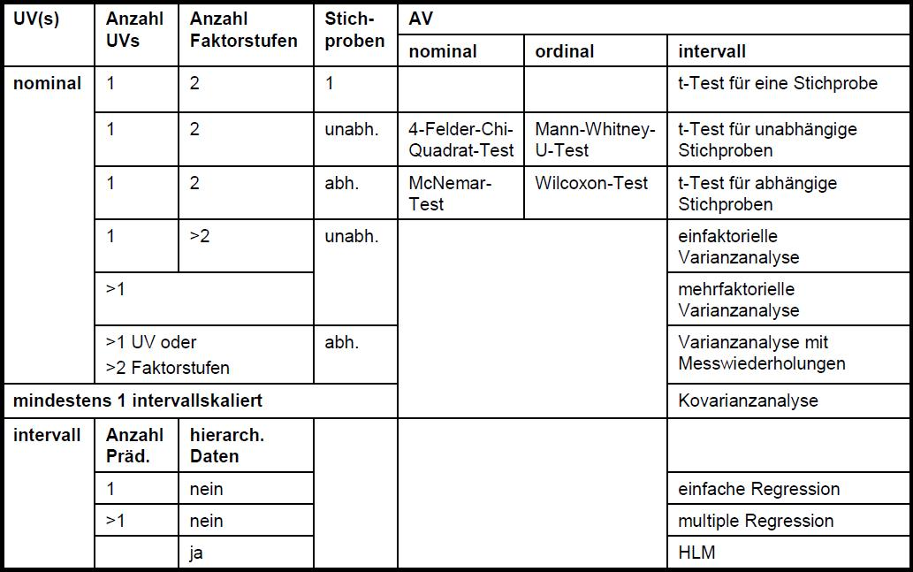

```{r setup, include=FALSE}
knitr::opts_chunk$set(echo = T, warning = F, message = F)
# download.file("https://drive.google.com/uc?export=download&id=1wuMqL_Z8T9rxuGvn0VP6siag90kHDm2O", 
#               "../www/references.bib", overwrite = T)

library(shiny)
library(tidyverse)
library(BayesFactor)
```


## Lernziele

* Ergebnisse inferenzstatistischer Tests interpretieren können

\

* Erster Überblick über unterschiedliche inferenzstatistischen Tests

\

* Effekstärke t-Test berechnen können

\

* Voraussetzungen inferenzstatistischer Tests kennen (t-Test)


## Ablauf | Diese Sitzung

* Recap vorbereitende Aufgaben

\

* Übersicht zu inferenzstatistischen Tests

\

* Effektstärke & Voraussetzungen t-Test


## Recap: Vorbereitende Aufgabe | Berechnung & Interpretation t-Test

Schauen Sie nochmals die zwei vorbereitenden Aufgaben durch: [Link](https://raw.githack.com/j-5chneider/qda-ss2020/master/6_Sitzung/Aufgabe.html)

* __Aufgabe 1:__ Wie ist es Ihnen gelungen die Ergebnisse der beiden t-Tests zu berechnen?
* Ideen zu __Aufgabe 2:__ "Welche Formulierungen in diesen Ausführungen sind aus den obigen Ergebnissen allerdings so nicht ableitbar?"

<div class="notes">

- inferenzstatistik: p-Werte kleiner .05 gelten als "signifikant" > H0 wird zurückgewiesen
   - "arbiträrer" Wert
- frequentistisch testet nur die H0
- BF hat den Unterschied zwischen H1 und H0 getestet, nicht zwischen allen 3 Hyp

</div>

## Recap: Vorbereitende Aufgabe | Artikel Harks & Hannover, (2020)
<iframe src="https://embed.polleverywhere.com/discourses/JiHGduN84emGvfbsG1Jfx?controls=all&short_poll=true" width="800" height="600" frameBorder="0"></iframe>

## Recap: Vorbereitende Aufgabe | Artikel Harks & Hannover, (2020)

Schauen Sie nochmals in den Artikel von Harks & Hannover, (2020):  
\

Was fällt Ihnen zur Hypothese, den dazugehörigen Auswertungen und daraus abgeleiteten Interpretationen auf?  

1. Notieren Sie hierzu Stichpunkte auf [PollEv.com/js123](https://PollEv.com/js123)
2. Voten Sie Stichpunkte (Daumen hoch/ runter)

<div class="notes">

- Hypothese ist gerichtet
- inferenzstatistik: frequentistischer t-Test. Auswertungen sind nicht signifikant.
- Interpretation eht aber trotzdem in die Richtung: Es gibt keinen Unterschied.

</div>

  
# Übersicht inferenzstatistische Tests

## &nbsp;


## &nbsp;


<div class="notes">

- t-Test Baum markieren
- Beispiele für t-Test benennen
- auf Voraussetzungen hinweisen

</div>


## Übersicht inferenzstatistische Tests

Siehe auch ausführlichere Tabelle auf Moodle  


# Effektstärke & Voraussetzungen t-Test

## Effektstärke t-Test | Cohen's d

```{r}
t.test(formula = mpg ~ am,  # frequentistischer t-Test
       data = mtcars,
       var.equal = T)
```

## Effektstärke t-Test | Cohen's d

```{r, eval = F}
# die Funktion `cohen.d` befindet sich im Paket `effsize`
install.packages("effsize")    # Paket installieren (nur 1x)
library(effsize)               # nach jedem Neustart von R Paket laden
cohen.d(formula = mpg ~ am,
        data = mtcars)
```

```{r, echo = F}
# this script is purely for results
library(effsize)               # nach jedem Neustart von R Paket laden
cohen.d(formula = mpg ~ am,
        data = mtcars)
```


## Voraussetzungen t-Test | angewendet bei...

* Vergleich des Unterschieds zweier Mittelwerte 


## Voraussetzungen t-Test | angewendet bei...

* Vergleich des Unterschieds zweier Mittelwerte 

<div class="box45l">
```{r, echo = F}
unabh <- data.frame(group = c(rep("Experimentalgruppe", 4), rep("Kontrollgruppe", 4)),
           test = rnorm(8, 3, 1),
           ID = c("Ayse", "Bertram", "Caroline", "Daniel", "Erhan", "Frank", "Gert", "Hannah"))

library(pander)
pander(unabh)
```
</div>


## Voraussetzungen t-Test | angewendet bei...

* Vergleich des Unterschieds zweier Mittelwerte 

<div class="box45l">
```{r, echo = F}
pander(unabh)
```
</div>

<div class="box45r">
```{r, echo = F}
pander(
data.frame(ID = c("Ayse", "Bertram", "Caroline", "Daniel"),
           Vortest = rnorm(4, 3, 1),
           Nachtest = rnorm(4, 3, 1))
)
```
</div>


## Voraussetzungen t-Test | angewendet bei...

* Vergleich des Unterschieds zweier Mittelwerte 

\

* AV (abhängige Variable): mindestens intervall skaliert

\

* UV (unabhängige Variable): binär, nominal skaliert

\

* Stichproben:
  - unabhängig: t-Test für unabhängige Stichproben
  - abhängig (auch "gepaart"): t-Test für abhängige Stichproben
  - eine: t-Test für eine Stichprobe

## Voraussetzungen t-Test | angewendet bei...

* Vergleich des Unterschieds zweier Mittelwerte 

\

* AV (abhängige Variable): mindestens intervall skaliert

\

* UV (unabhängige Variable): binär, nominal skaliert

\

* Stichproben:
  - unabhängig: t-Test für unabhängige Stichproben
  - abhängig (auch "gepaart"): t-Test für abhängige Stichproben
  - eine: t-Test für eine Stichprobe
  
<div style="position: absolute; top: 55%; left: 70%; width: 33%">
```{r, echo = T, eval=F}
# unabhängige Stichproben
t.test(formula = mpg ~ am,
       data = mtcars,
       paired = FALSE)

# abhängige Stichproben
t.test(x = mtcars$mpg,
       y = mtcars$am,
       paired = TRUE)

# eine Stichprobe
t.test(x = mtcars$mpg,
       mu = 0)
```
</div>
  
## Voraussetzungen t-Test | für unabhängige Stichproben

* unabhängige Stichproben

\

* Varianzen $\sigma^2_1$ und $\sigma^2_2$ der zu vergleichenden Populationen sind gleich (homogen)

```{r, echo = F, eval=T, fig.height=3.5}
tmp <- data.frame(x = c(rnorm(200, 0, 1), rnorm(200, 4, 3)),
                  group = c(rep(1, 200), rep(0, 200)))

library(ggplot2)
ggplot(tmp, aes(x=x, group = group, fill = as.factor(group))) +
  geom_density(alpha = .6)
```


## Voraussetzungen t-Test | für unabhängige Stichproben

* unabhängige Stichproben<br /> `r icon("arrow-right")` Design

\

* Varianzen $\sigma^2_1$ und $\sigma^2_2$ der zu vergleichenden Populationen sind gleich (homogen)<br /> `r icon("arrow-right")` Levene-Test

\

* Merkmal in beiden Populationen normalverteilt<br /> `r icon("arrow-right")` Kolmogorov-Smirnov-Test


## Voraussetzungen t-Test | Levene-Test (frequentistisch)

* $H_0:\sigma^2_1 = \sigma^2_2$
* $p<.05$: Nullhypothese zurückweisen ($P(D | H_0)$)
* Daumenregel: $p>.20$

```{r, eval = F}
# die Funktion `leveneTest` befindet sich im Paket `car`
install.packages("car")               # Paket installieren (nur 1x)
library(car)                          # nach jedem Neustart von R Paket laden
leveneTest(y = mpg ~ as.factor(am),   # der Levene test möchte, dass am hier als Faktor definiert wird
           data = mtcars)
```

```{r, echo = F}
# this script is purely for results
library(car)               # nach jedem Neustart von R Paket laden
leveneTest(mpg ~ as.factor(am),
           data = mtcars)
```

## Voraussetzungen t-Test | Kolmogorov-Smirnov-Test (frequentistisch)

* $H_0:$ Variable ist normalverteilt
* $p<.05$: Nullhypothese zurückweisen ($P(D | H_0)$)
* Daumenregel: $p>.20$

```{r}
# keine Installation von Paketen nötig
# ks.test() ist bereits vorinstalliert und geladen
ks.test(x = mtcars$mpg,    # welche Variable soll getestet werden?
        y = "pnorm",       # welche Verteilung interessiert uns? Hier Normalverteilung: "pnorm"
        mean(mtcars$mpg),  # wie ist der Mittelwert der Variable?
        sd(mtcars$mpg))    # wie ist die Standardabweichung der Variable?
```


## Voraussetzungen t-Test | Kolmogorov-Smirnov-Test (frequentistisch)

```{r}
ks.test(x = mtcars$mpg[mtcars$am == 0],    # welche Variable soll getestet werden?
        y = "pnorm",       # welche Verteilung interessiert uns? Hier Normalverteilung: "pnorm"
        mean(mtcars$mpg[mtcars$am == 0]),  # wie ist der Mittelwert der Variable?
        sd(mtcars$mpg[mtcars$am == 0]))    # wie ist die Standardabweichung der Variable?
```

```{r}
ks.test(x = mtcars$mpg[mtcars$am == 1],    # welche Variable soll getestet werden?
        y = "pnorm",       # welche Verteilung interessiert uns? Hier Normalverteilung: "pnorm"
        mean(mtcars$mpg[mtcars$am == 1]),  # wie ist der Mittelwert der Variable?
        sd(mtcars$mpg[mtcars$am == 1]))    # wie ist die Standardabweichung der Variable?
```


## Voraussetzungen t-Test | unabhängige Stichproben: Verletzung der Voraussetzungen

* Varianzen ungleich (heterogen)<br /> `r icon("arrow-right")` Welch-Test

<div class="box45l" style="margin-top:5%">
```{r}
# klassischer t-Test für unabhängige Stichproben
t.test(formula = mpg ~ am,
       data = mtcars,
       paired = FALSE,
       var.equal = TRUE)    # Varianzen gleich
```

</div>


## Voraussetzungen t-Test | unabhängige Stichproben: Verletzung der Voraussetzungen

* Varianzen ungleich (heterogen)<br /> `r icon("arrow-right")` Welch-Test

<div class="box45l" style="margin-top:5%">
```{r}
# klassischer t-Test für unabhängige Stichproben
t.test(formula = mpg ~ am,
       data = mtcars,
       paired = FALSE,
       var.equal = TRUE)    # Varianzen gleich
```

</div>

<div class="box45r" style="margin-top:5%">
```{r}
# Welch Test
t.test(formula = mpg ~ am,
       data = mtcars,
       paired = FALSE,
       var.equal = FALSE)   # Varianzen ungleich
```
</div>

## Voraussetzungen t-Test | unabhängige Stichproben: Verletzung der Voraussetzungen

* Varianzen ungleich (heterogen)<br /> `r icon("arrow-right")` Welch-Test
* Variablen nicht normalverteilt<br /> `r icon("arrow-right")` kein Problem, wenn $N > 30$<br /> `r icon("arrow-right")` sonst: Mann-Whitney-U-Test (für ordinalskalierte Variblen)


# Workflow

## Workflow | bei Datenauswertung

1. Anwendungsbedingungen:
   - Welche Erkenntnis interessiert mich? (Fragestellung)
   - Welchen Test benötige ich? (z.B. skalenniveau, Anzahl Variablen)
2. Voraussetzungen prüfen
3. Test berechnen
4. Interpretationen ableiten


# Vielen Dank | Für die Aufmerksamkeit

# Literatur